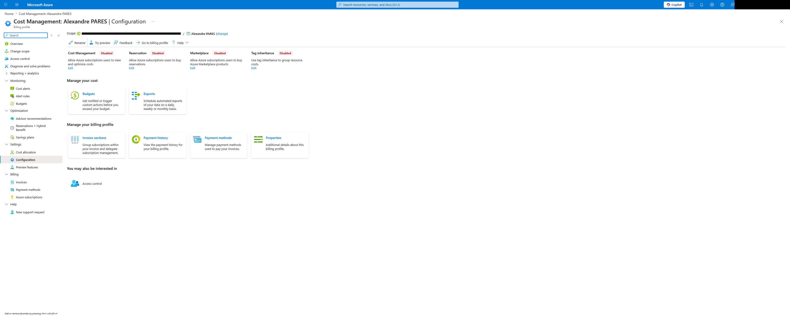

# Disable all Cost Management features on a MCA billing profile



## Usage

```hcl
module "billing_profile_settings" {
  source  = "alexandre-pares/billing-settings/azure"
  version = "1.0.0"

  scope_id = var.scope_id

  enable_cost_management  = false
  enable_reservation      = false
  enable_saving_plan      = false
  enable_marketplace      = false
}
```

<!-- BEGIN_TF_DOCS -->
## Requirements

| Name | Version |
| ---- | ------- |
| <a name="requirement_terraform"></a> [terraform](#requirement\_terraform) | ~> 1.8 |
| <a name="requirement_azapi"></a> [azapi](#requirement\_azapi) | ~> 2 |

## Providers

No providers.

## Modules

| Name | Source | Version |
| ---- | ------ | ------- |
| <a name="module_billing_profile_settings"></a> [billing\_profile\_settings](#module\_billing\_profile\_settings) | ../.. | n/a |

## Resources

No resources.

## Inputs

| Name | Description | Type | Default | Required |
| ---- | ----------- | ---- | ------- | :------: |
| <a name="input_scope_id"></a> [scope\_id](#input\_scope\_id) | Id of the billing scope. For this example we use a MCA billing profile.<br/><br/>  Examples:<br/><br/>  - `/providers/Microsoft.Billing/billingAccounts/00000000-0000-5000-3000-000000000000:00000000-0000-4000-0000-000000000000_2019-05-31/billingProfiles/0000-0000-000-000` - MCA Billing profile | `string` | n/a | yes |

## Outputs

| Name | Description |
| ---- | ----------- |
| <a name="output_settings"></a> [settings](#output\_settings) | Map of updated billing settings.<br/><br/>  - `viewCharges` - Allow Azure subscriptions users to view and optimize costs.<br/>  - `reservationPurchases` - Allow users with access to an Azure subscription to buy Azure Reservations.<br/>  - `savingsPlanPurchases` - Allow users with access to an Azure subscription to buy Azure Saving Plans.<br/>  - `marketplacePurchases` - Allow users with access to an Azure subscription to buy Azure Marketplace products.<br/>  - `invoiceSectionLabelManagement` - Controls invoice section label management at invoice section scope.<br/><br/>  ---<br/><br/>  Example:<pre>hcl<br/>  {<br/>    "viewCharges"                   = "NotAllowed"<br/>    "reservationPurchases"          = "NotAllowed"<br/>    "savingsPlanPurchases"          = "NotAllowed"<br/>    "marketplacePurchases"          = "NotAllowed"<br/>    "invoiceSectionLabelManagement" = "Allowed"<br/>  }</pre> |
<!-- END_TF_DOCS -->
